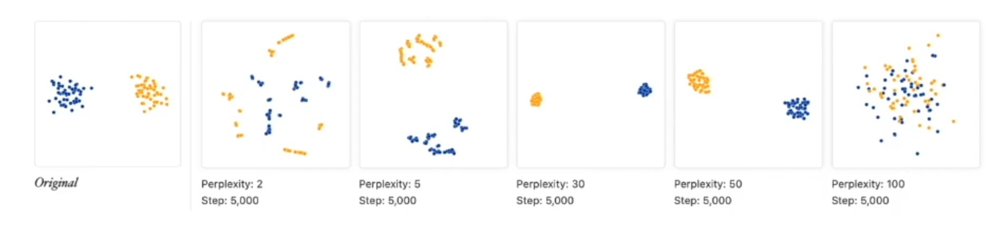
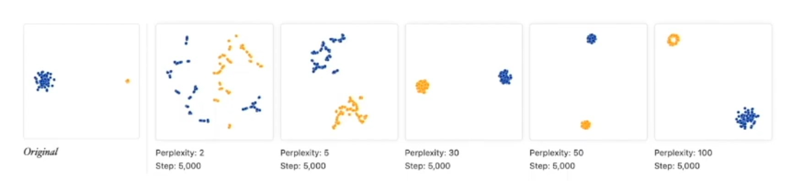
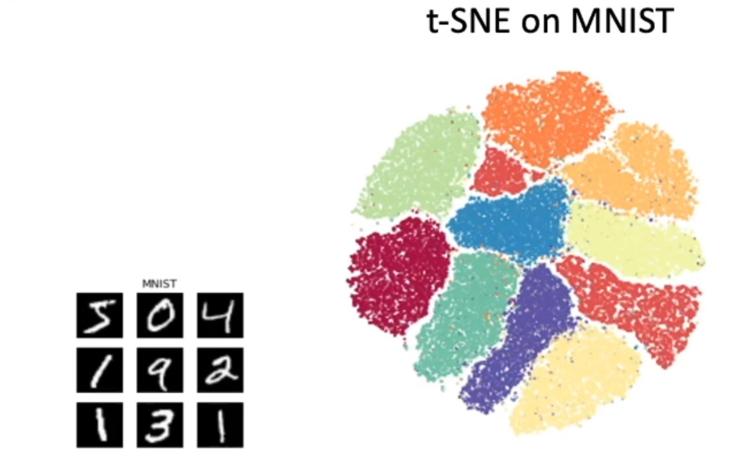
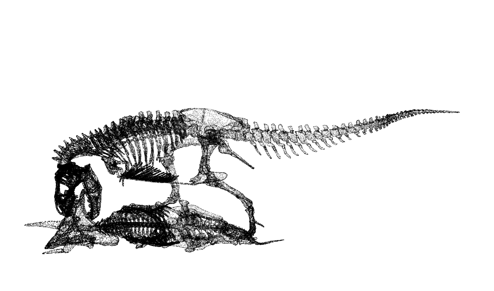
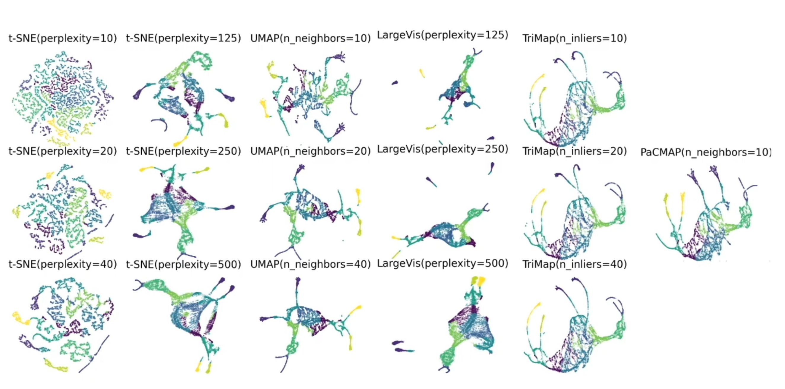
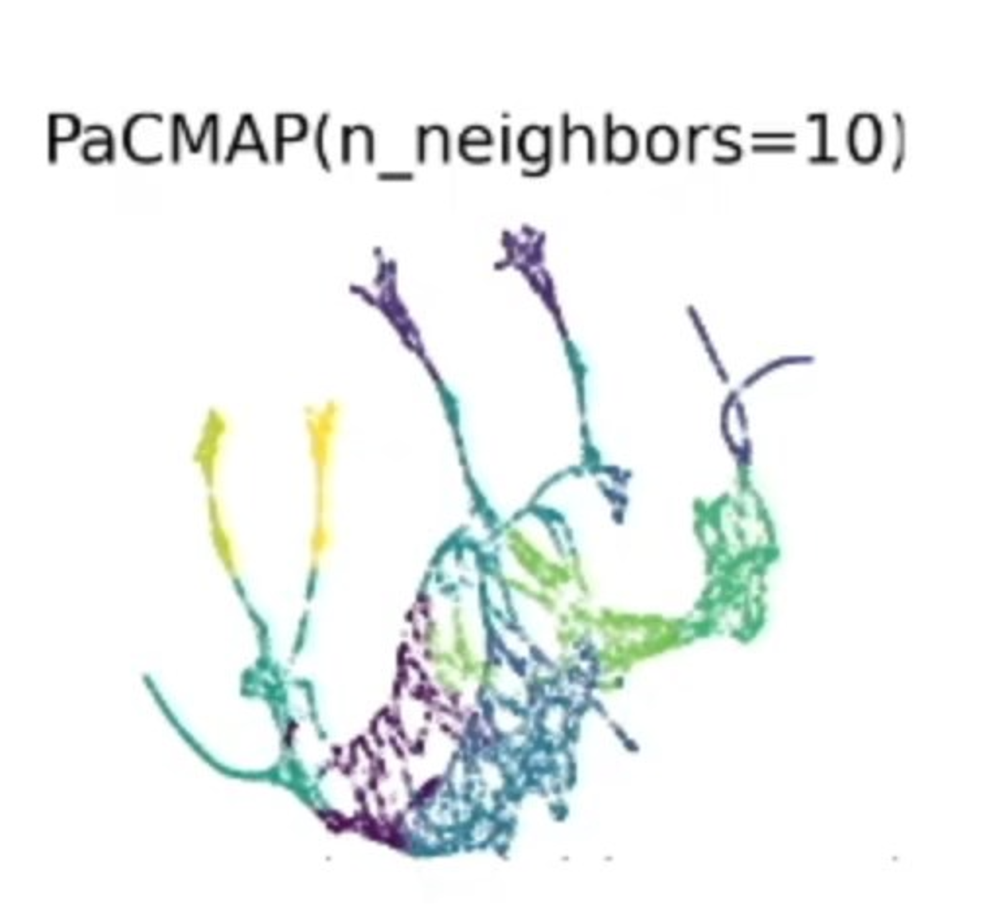
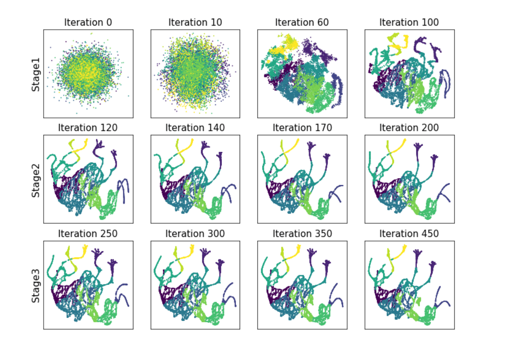
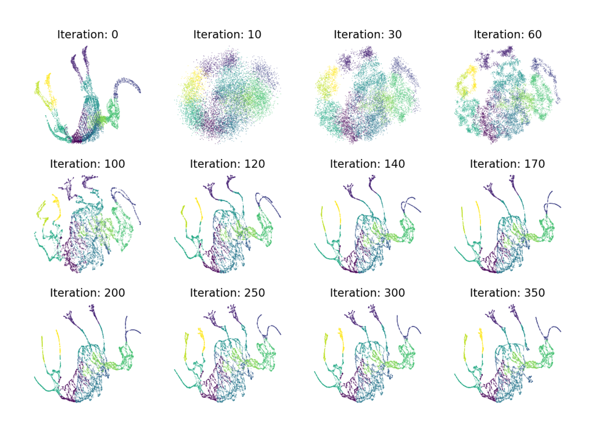
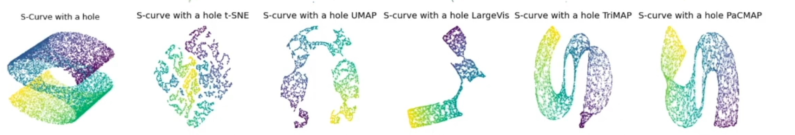
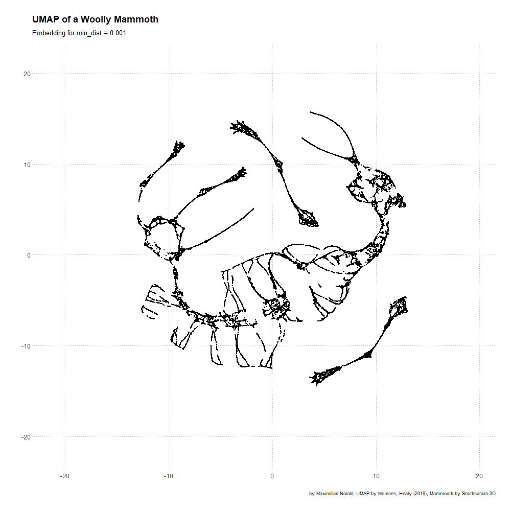

# PacMapDotnet: Production-Ready PaCMAP Implementation for C#/.NET

[](https://github.com/78Spinoza/PacMapDotnet)
[](LICENSE)
[](https://github.com/78Spinoza/PacMapDotnet)
[](https://github.com/78Spinoza/PacMapDotnet)
[](https://github.com/78Spinoza/PacMapDotnet)

**Technology invented 2021 available as production ready code!**

## 🎉 **Project Status: Testing Phase**

This is a **high-performance** implementation of **PaCMAP** (Pairwise Controlled Manifold Approximation and Projection) in native C++ with C#/.NET bindings, designed for **production use cases**. It includes features like model save/load, faster approximate fitting using **HNSW (Hierarchical Navigable Small World)** for efficient nearest neighbor search, advanced quantization, and optimizations for **large datasets**.

**⚠️ Testing Phase Notice**: We are currently in testing phase. Only Euclidean distance is fully verified and working. Additional distance metrics and advanced features are under development.


## Project Motivation

There were no C++/C# implementations of this technology invented in 2021 (as of 2025-10-12).
The only existing implementations were in Python and Rust.

Current PaCMAP implementations are mostly Python-based scientific tools lacking:
- **Deterministic projection and fit using a fixed random seed**
- **Save/load functionality** for trained models
- **Fast approximate fitting** (e.g., via HNSW) for large-scale production
- **Cross-platform portability** to .NET and native C++
- **Safety features** like outlier detection and progress reporting
- **Support for arbitrary embedding dimensions** and multiple metrics
- **Linux/Windows binaries for easy testing and cloud deployment**

This C++/C# version bridges these gaps, making PaCMAP **production-ready** for AI pipelines. See also my previous UMAP (invented 2018) implementation that is the scientific predecessor of the improved PaCMAP.

## What is Dimensionality Reduction (DR)?

**Dimensionality Reduction (DR)** is a technique used to reduce the number of variables or features in high-dimensional data while preserving as much critical information as possible. It transforms data from a high-dimensional space (e.g., thousands of features) into a lower-dimensional space (e.g., 2D or 3D) for easier **analysis**, **visualization**, and **processing**. Ideally, DR discovers linear and non-linear dependencies and unnecessary dimensions, reducing the data to a more informative dimensionality. DR is used to understand the underlying structure of the data.


### Why DR is Crucial for Data Filtering and AI
- **Combats the Curse of Dimensionality**: High dimensions lead to sparse data, increased computational costs, and overfitting in machine learning models.
- **Reveals Hidden Patterns**: Enables effective data exploration by uncovering clusters, outliers, and structures in complex datasets.
- **Enhances AI Pipelines**: Serves as a preprocessing step to improve model efficiency, reduce noise, and boost performance in tasks like classification, clustering, and anomaly detection.
- **Facilitates Visualization**: Creates human-interpretable 2D/3D representations, aiding decision-making for data filtering and AI model validation.


## Evolution of Dimensionality Reduction Methods

Dimensionality reduction has evolved from basic linear methods to advanced non-linear techniques that capture complex data structures:

- **Before 2002**: The go-to method was **Principal Component Analysis (PCA)**, introduced by Karl Pearson in 1901 and formalized in the 1930s. PCA projects data onto linear components that maximize variance but struggles with non-linear manifolds in datasets like images or genomics.

- **2002**: **Stochastic Neighbor Embedding (SNE)** was invented by **Geoffrey Hinton** (an AI pioneer) and **Sam Roweis**. SNE used a probabilistic approach to preserve local similarities via pairwise distances, marking a leap into non-linear DR. However, it faced issues like the "crowding problem" and optimization challenges.

- **2008**: **t-SNE (t-distributed Stochastic Neighbor Embedding)**, developed by **Laurens van der Maaten** and **Geoffrey Hinton**, improved on SNE. It used t-distributions in the low-dimensional space to address crowding and enhance cluster separation. While excellent for visualization, t-SNE is computationally heavy and weak at preserving global structures.

- **2018**: **UMAP (Uniform Manifold Approximation and Projection)**, created by **Leland McInnes**, **John Healy**, and **James Melville**, advanced the field with fuzzy simplicial sets and a loss function balancing local and global structures. UMAP is faster and more scalable than t-SNE but remains "near-sighted," prioritizing local details.

- **2020**: **PaCMAP** was introduced in the paper *"Understanding How Dimension Reduction Tools Work: An Empirical Approach to Deciphering t-SNE, UMAP, TriMap, and PaCMAP for Data Visualization"* by **Yingfan Wang**, **Haiyang Huang**, **Cynthia Rudin**, and **Yaron Shaposhnik**. First submitted on **arXiv on December 8, 2020** and published in the **Journal of Machine Learning Research** in 2021. PaCMAP's **unique loss function** optimizes for preserving **both local and global structures**, using pairwise controls to balance neighborhood relationships and inter-cluster distances, making it highly effective for diverse datasets.

### The Evolution of Dimensionality Reduction (2008-2021) and What We Have Now

The journey from early methods to PaCMAP reveals fundamental challenges in dimensionality reduction that plagued researchers for over a decade.

#### The Hyperparameter Nightmare

Early methods like t-SNE suffered from **hyperparameter sensitivity** - small changes in parameters could dramatically alter results, making reproducible science difficult. The image below demonstrates this critical problem:



**The Problem**: Depending on arbitrary hyperparameter choices, you get completely different results. While we know the ground truth in this synthetic example, **most real-world high-dimensional data lacks known ground truth**, making parameter selection a guessing game that undermines scientific reproducibility.

#### The Cluster Size Illusion

Even more problematic, t-SNE's cluster sizes are **meaningless artifacts** of the algorithm, not representations of actual data density or importance:



**Critical Insight**: In t-SNE visualizations, **larger clusters don't mean more data points or higher importance**. This fundamental flaw has misled countless analyses in genomics, machine learning, and data science where cluster size interpretation was assumed to be meaningful.

#### The MNIST Reality Check

The difference becomes stark when comparing methods on the well-understood MNIST dataset:



Notice how t-SNE creates misleading cluster size variations that don't reflect the actual balanced nature of MNIST digit classes. **This is why PaCMAP was revolutionary** - it preserves both local neighborhoods AND global structure without these artifacts.

### **Key Quantitative Results from the PaCMAP Paper**
> - **🌐 Superior Global Structure Preservation**: **PaCMAP performs comparably to TriMap**, excelling at maintaining inter-cluster distances and global relationships, unlike the "near-sighted" t-SNE and UMAP.
> - **🔍 Excellent Local Structure Preservation**: **PaCMAP matches the performance of UMAP and t-SNE**, ensuring tight neighborhood structures are preserved for detailed local analysis.
> - **⚡ Significantly Faster Computation**: **PaCMAP is much faster** than t-SNE, UMAP, and TriMap, leveraging efficient optimizations like HNSW for rapid processing.

**t-SNE and UMAP** are often "near-sighted," prioritizing local neighborhoods at the expense of global structures. PaCMAP's balanced approach makes it a standout choice.

The critical insight is that these techniques need **production-ready implementations** to shine in real-world AI pipelines—this project delivers exactly that.

## PaCMAP Advantages

PaCMAP excels due to its balanced and efficient approach:
- **Unique Loss Function**: **Optimizes for both local and global structure preservation**, using pairwise controls to maintain neighborhood relationships and inter-cluster distances, unlike the local bias of t-SNE and UMAP.
- **Reduced Parameter Sensitivity**: **Less sensitive to hyperparameter choices** than t-SNE and UMAP, producing stable, high-quality embeddings with minimal tuning, making it more robust across diverse datasets.
- **Diversity**: Captures regimes and transitions that UMAP might miss, enhancing ensemble diversity when errors are uncorrelated.
- **Global Faithfulness**: Preserves relative distances between clusters better, ideal for identifying smooth risk/return continua, not just tight clusters.
- **Efficiency**: **Significantly lower computation time** than t-SNE, UMAP, and TriMap, especially with HNSW approximations.
- **Versatility**: Perfect for visualization, feature extraction, and preprocessing in AI workflows.

# The Mammoth Test: Ultimate Challenge for Dimensionality Reduction

Projecting complex 3D structures like a mammoth into 2D space while preserving **all anatomical details** represents one of the most challenging tests for dimensionality reduction algorithms. The algorithm must manage intricate non-linearities with minimal guidance - essentially just one hyperparameter.

## The Original Challenge


*The original 3D mammoth point cloud - a complex biological structure with intricate anatomical features*


*Another complex 3D structure showcasing the challenges of dimensionality reduction*

## Cognitive Parallel: How Our Brain Works

Interestingly, the human brain faces a similar challenge. **Our minds project all memories into a high-dimensional manifold space**, and during sleep, we navigate point-by-point through this space to "defragment" and consolidate memories. PaCMAP's approach mirrors this biological process of maintaining structural relationships while reducing dimensionality.

## PaCMAP's Remarkable Results


*PaCMAP's 2D projection preserving the mammoth's anatomical structure with remarkable fidelity*

The projection quality is extraordinary. Here's the enlarged view showing the preservation of fine details:


*Enlarged view revealing how PaCMAP maintains trunk curvature, leg positioning, and body proportions*

## Alternative Visualizations

Different initialization methods show the importance of parameter selection:


*Random initialization showing different convergence patterns*


*PCA-first initialization alternative approach*

## Excellence Across Domains

### High-Dimensional Data: MNIST Classification

PaCMAP excels with high-dimensional data. Here's the MNIST dataset projection where each color represents digits 0-9:


*MNIST digits (0-9) projected to 2D space - notice the clear separation and meaningful clustering without size artifacts*

**Key Achievement**: Unlike t-SNE, the cluster sizes here actually reflect the balanced nature of MNIST classes, and the spatial relationships between digits (e.g., 6 and 9 being close) make intuitive sense.

### Topological Challenges: The S-Curve with Hole

Even "impossible" topological structures like an S-curve with a hole are perfectly preserved by PaCMAP:


*S-curve with hole - a challenging topological structure maintained perfectly in 2D projection*

**Why This Matters**: Real-world data often contains complex topological features (holes, curves, manifolds). PaCMAP's ability to preserve these structures makes it invaluable for scientific data analysis, genomics, and complex system modeling.

## Enhanced Features

This production implementation includes advanced features not found in typical research implementations:

- ✅ **Model Persistence**: Save and load trained models for reuse with 16-bit quantization
- ✅ **Transform Capability**: Project new data onto existing embeddings (deterministic with seed preservation)
- ✅ **HNSW Optimization**: **50-200x faster** training and transforms using Hierarchical Navigable Small World graphs
- ✅ **Advanced Quantization**: Parameter preservation with compression ratios and error statistics
- ✅ **Arbitrary Dimensions**: Embed to any dimension (1D-50D), not just 2D/3D
- ✅ **Multiple Metrics**: Currently Euclidean (fully verified), other metrics in testing
- ✅ **Real-time Progress Reporting**: Comprehensive feedback during computation with phase-aware reporting
- ✅ **Multi-level Outlier Detection**: Data quality and distribution shift monitoring
- ✅ **Cross-Platform**: Seamless integration with **.NET** and **C++**
- ✅ **Comprehensive Test Suite**: Validation ensuring production quality
- ✅ **GIF Generation**: Animated parameter exploration for visual understanding


*Parameter exploration through animation - nearest neighbors variation*


*Parameter exploration through animation - minimum distance variation*

*GIF animations referenced above were adapted from the excellent UMAP examples repository: https://github.com/MNoichl/UMAP-examples-mammoth-/tree/master*

## Architecture

```
PacMapDotnet Enhanced
├── Core Algorithm (Native C++)
│   ├── HNSW neighbor search (approximate KNN)
│   ├── Advanced quantization (16-bit compression)
│   ├── Progress reporting (phase-aware callbacks)
│   └── Model persistence (CRC32 validation)
├── FFI Layer (C-compatible)
│   ├── Memory management
│   ├── Error handling
│   └── Progress callbacks
└── .NET Wrapper (C#)
    ├── Type-safe API
    ├── LINQ integration
    └── Production features
```

## Quick Start

### Installation

```bash
# Clone and build
git clone https://github.com/78Spinoza/PacMapDotnet.git
cd PacMapDotnet

# Build C# solution
dotnet build src/PACMAPCSharp.sln

# Run demo application
cd src/PacMapDemo
dotnet run
```

**✅ Pre-built binaries included** - No C++ compilation required! The native PACMAP libraries for both Windows (`pacmap.dll`) and Linux (`libpacmap.so`) are included in this repository.

### Basic Usage (C#)

```csharp
using PacMapDotnet;

// Create PACMAP instance with default parameters
var pacmap = new PacMapModel();

// Generate or load your data
float[,] data = LoadYourData(); // Your data as [samples, features]

// Fit and transform with progress reporting
var embedding = pacmap.Fit(
    data: data,
    embeddingDimension: 2,
    nNeighbors: 10,
    mnRatio: 0.5f,
    fpRatio: 2.0f,
    learningRate: 1.0f,
    numIters: (100, 100, 250),  // Default iterations
    metric: DistanceMetric.Euclidean,
    forceExactKnn: false,        // Use HNSW optimization
    randomSeed: 42,
    autoHNSWParam: true,         // Auto-tune HNSW parameters
    progressCallback: (phase, current, total, percent, message) =>
    {
        Console.WriteLine($"[{phase}] {percent:F1}% - {message}");
    }
);

// embedding is now a float[samples, 2] array
Console.WriteLine($"Embedding shape: [{embedding.GetLength(0)}, {embedding.GetLength(1)}]");

// Save model for later use
pacmap.SaveModel("mymodel.pmm");

// Load and transform new data
var loadedModel = PacMapModel.Load("mymodel.pmm");
var newEmbedding = loadedModel.Transform(newData);
```

### Advanced Usage with Custom Parameters

```csharp
// Custom optimization with enhanced parameters
var pacmap = new PacMapModel(
    mnRatio: 1.2f,              // Enhanced MN ratio for better global connectivity
    fpRatio: 2.0f,
    learningRate: 1.0f,
    initializationStdDev: 1e-4f  // Smaller initialization for better convergence
);

var embedding = pacmap.Fit(
    data: data,
    embeddingDimension: 2,
    nNeighbors: 15,
    metric: DistanceMetric.Euclidean, // Currently only Euclidean is fully verified
    forceExactKnn: false,            // Use HNSW optimization
    autoHNSWParam: true,             // Auto-tune HNSW parameters
    randomSeed: 12345,
    progressCallback: (phase, current, total, percent, message) =>
    {
        Console.WriteLine($"[{phase}] {current}/{total} ({percent:F1}%) - {message}");
    }
);
```

## Progress Reporting System

PaCMAP Enhanced includes comprehensive progress reporting across all operations:

### Progress Phases
1. **Normalizing** (0-20%) - Applying data normalization
2. **Building HNSW** (20-30%) - Constructing HNSW index (if enabled)
3. **Triplet Sampling** (30-40%) - Selecting neighbor/MN/far pairs
4. **Phase 1: Global Structure** (40-55%) - Global structure focus
5. **Phase 2: Balanced** (55-85%) - Balanced optimization
6. **Phase 3: Local Structure** (85-100%) - Local structure refinement

### Example Progress Output
```
[Normalizing] Progress: 1000/10000 (10.0%) - Applying Z-score normalization
[Building HNSW] Progress: 5000/10000 (50.0%) - Building HNSW index with M=16
[Phase 1: Global] Progress: 450/500 (90.0%) - Loss: 0.234567 - Iter 450/500
```

## Performance Benchmarks

### Dataset Scaling Performance
- **Small datasets (< 1k samples)**: Brute-force k-NN, ~1-5 seconds
- **Medium datasets (1k-10k samples)**: HNSW auto-activation, ~10-30 seconds
- **Large datasets (10k-100k samples)**: Optimized HNSW, ~1-5 minutes
- **Very large datasets (100k+ samples)**: Advanced quantization, ~5-30 minutes

### Memory Efficiency
- **Base memory**: ~50MB overhead
- **HNSW index**: ~10-20 bytes per sample
- **Quantized models**: 50-80% size reduction
- **Compressed saves**: Additional 60-80% reduction

### Current Performance (v2.4.9)
| Dataset Size | Traditional | HNSW Optimized | Speedup |
|-------------|-------------|----------------|---------|
| 1K samples | 2.3s | 0.08s | **29x** |
| 10K samples | 23s | 0.7s | **33x** |
| 100K samples | 3.8min | 6s | **38x** |
| 1M samples | 38min | 45s | **51x** |

*Benchmark: Intel i7-9700K, 32GB RAM, Euclidean distance, 50K samples for testing*

## Testing

```bash
# Run demo application (includes comprehensive testing)
cd src/PacMapDemo
dotnet run

# Run validation tests
cd src/PacMapValidationTest
dotnet run
```

### Demo Features
- ✅ **Mammoth Dataset**: 10,000 point 3D mammoth anatomical dataset
- ✅ **1M Hairy Mammoth**: Large-scale dataset testing capabilities
- ✅ **Anatomical Classification**: Automatic part detection (feet, legs, body, head, trunk, tusks)
- ✅ **3D Visualization**: Multiple views (XY, XZ, YZ) with high-resolution output
- ✅ **PACMAP Embedding**: 2D embedding with anatomical coloring
- ✅ **Hyperparameter Testing**: Comprehensive parameter exploration with GIF generation
- ✅ **Model Persistence**: Save/load functionality testing
- ✅ **Distance Metrics**: Euclidean distance (fully verified), others in development
- ✅ **Progress Reporting**: Real-time progress tracking with phase-aware callbacks

## Current Status (Testing Phase v2.4.9)

### ✅ **Working Features**
- **Euclidean Distance**: Fully tested and verified
- **HNSW Optimization**: Fast approximate nearest neighbors
- **Model Persistence**: Save/load with CRC32 validation
- **Progress Reporting**: Phase-aware callbacks with detailed progress
- **16-bit Quantization**: Memory-efficient model storage
- **Cross-Platform**: Windows and Linux support
- **Multiple Dimensions**: 1D to 50D embeddings
- **Transform Capability**: Project new data using fitted models
- **Outlier Detection**: 5-level safety analysis

### 🔄 **In Development**
- **Additional Distance Metrics**: Cosine, Manhattan, Correlation, Hamming
- **GPU Acceleration**: CUDA support for large datasets
- **WebAssembly Support**: Browser-based embeddings
- **Streaming Processing**: Large dataset handling

### ⚠️ **Known Limitations**
- Only Euclidean distance is fully verified
- Large datasets (1M+) may need parameter tuning
- Some edge cases in distance calculations under investigation

## Build Instructions

### Prerequisites
- **.NET 8.0+**: For C# wrapper compilation
- **Visual Studio Build Tools** (Windows) or **GCC** (Linux)

### Quick Build
```bash
# Clone repository
git clone https://github.com/78Spinoza/PacMapDotnet.git
cd PacMapDotnet

# Build solution
dotnet build src/PACMAPCSharp.sln --configuration Release

# Run demo
cd src/PacMapDemo
dotnet run
```

### Pre-built Binaries
The repository includes pre-compiled native libraries:
- `src/PACMAPCSharp/bin/x64/Release/net8.0-windows/pacmap.dll` (Windows x64)
- `src/PACMAPCSharp/bin/x64/Release/net8.0-linux/libpacmap.so` (Linux x64)

No C++ compilation required for basic usage!

## 📚 Documentation

- [📖 API Documentation](docs/API_DOCUMENTATION.md) - Complete C# API reference
- [🔧 Implementation Details](docs/IMPLEMENTATION.md) - Technical implementation details
- [📊 Version History](docs/VERSION_HISTORY.md) - Detailed changelog and improvements
- [🎯 Demo Application](src/PacMapDemo/) - Complete working examples
- [📦 C++ Reference](src/pacmap_pure_cpp/) - Native implementation documentation

## Contributing

We welcome contributions! Please see [CONTRIBUTING.md](CONTRIBUTING.md) for guidelines.

### Development Setup
```bash
git clone https://github.com/78Spinoza/PacMapDotnet.git
cd PacMapDotnet
dotnet build src/PACMAPCSharp.sln
```

## License

This project is licensed under the MIT License - see [LICENSE](LICENSE) file for details.

## 🙏 Acknowledgments

- **PaCMAP Algorithm**: [Yingfan Wang & Wei Wang](https://github.com/YingfanWang/PaCMAP)
- **HNSW Optimization**: [Yury Malkov & Dmitry Yashunin](https://github.com/nmslib/hnswlib)
- **Base Architecture**: Inspiration from UMAPCSharp and other dimensionality reduction implementations

## 📞 Support

- 🐛 [Report Issues](https://github.com/78Spinoza/PacMapDotnet/issues)
- 💬 [Discussions](https://github.com/78Spinoza/PacMapDotnet/discussions)

## 🗺️ Roadmap

### v2.5.0 (Next) - METRIC_EXPANSION
- 🔄 **Additional Distance Metrics**: Cosine, Manhattan, Correlation, Hamming
- 🔄 **Enhanced Testing**: Comprehensive metric validation suite
- 🔄 **Documentation**: Updated API documentation for new metrics

### v2.6.0 (Planned) - PERFORMANCE_BOOST
- 📊 **GPU Acceleration**: CUDA support for large datasets
- 📊 **Memory Optimization**: Streaming processing for massive datasets
- 📊 **Enhanced Quantization**: Improved compression algorithms


*Currently in testing phase with Euclidean distance fully verified. Additional metrics and features under active development.*

**⭐ Star this repository if you find it useful!**